# :iphone: BalloonSaga - Android Game :video_game:

BalloonSaga is android based mobile application. The application is basically an Arcade Gameand developed by the members of team RocketAppsStudio. This game aims to bring out your thinking skills and it is opened for people of all age groups. This is a game with new idea and developed and uploaded on Google Play store. 

This game is of real fun and excitement. It makes the player to think logically and pass through various indulging levels by receiving the stars at each level to unlock the further levels. This is a one player game with ten levels implemented in the game. Help section is included to give user the information about how to play the game and reach to final stages.

To download the game, goto Google Play Store or _[click here](https://play.google.com/store/apps/details?id=com.rocketapps.balloonsaga "BalloonSaga")_.

## Screenshots
### Game
> Splash Screen

> Main Screen

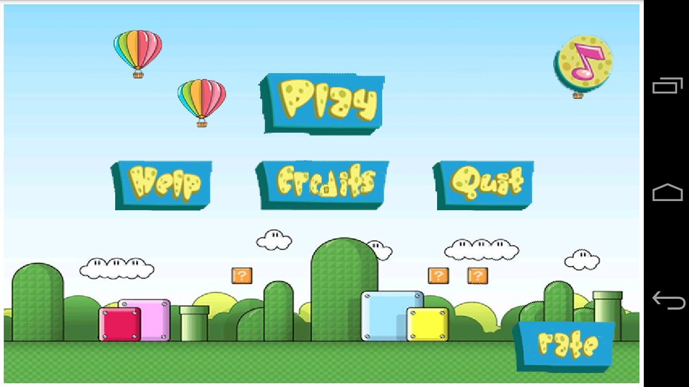

> Exit Screen

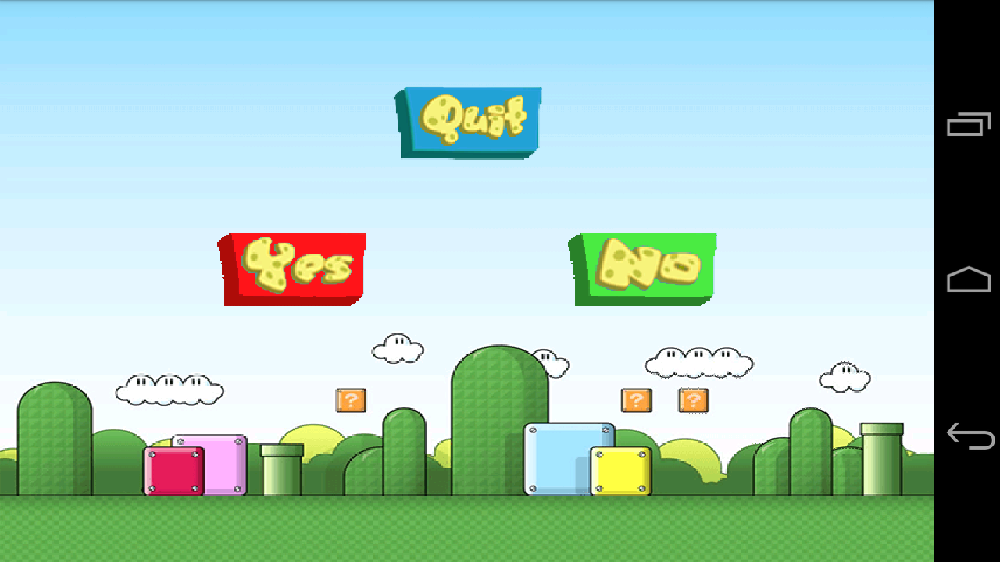

### Stages

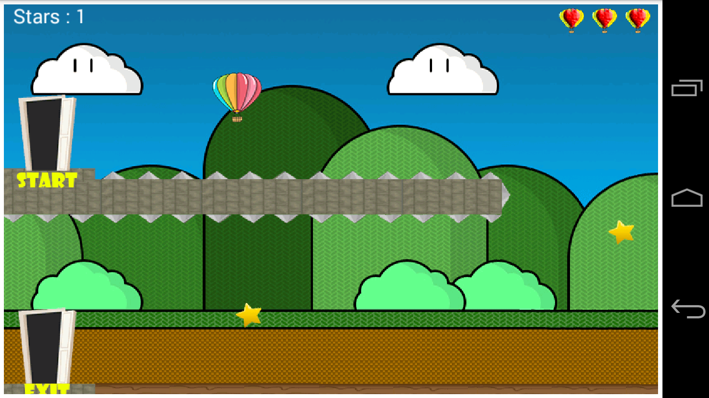

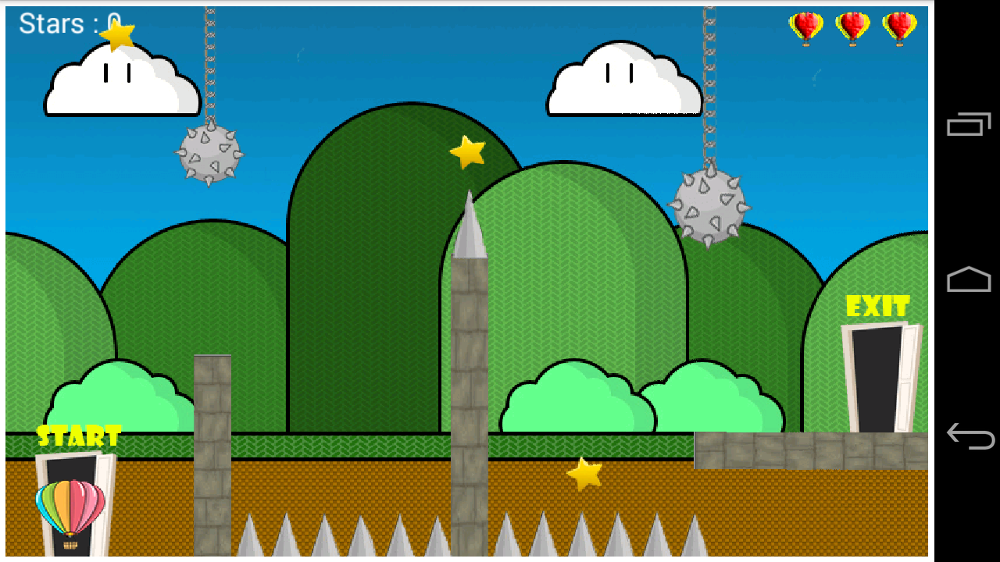

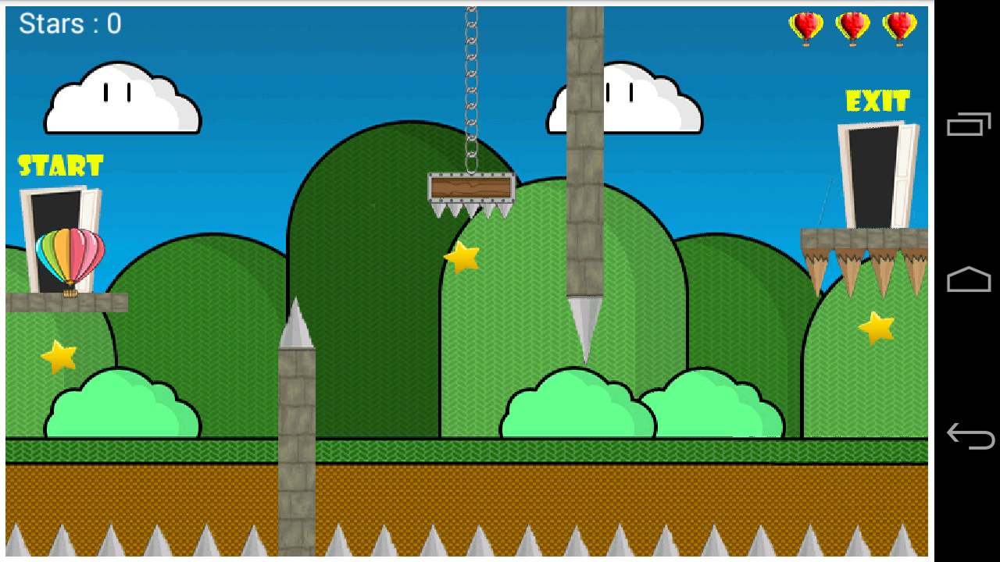

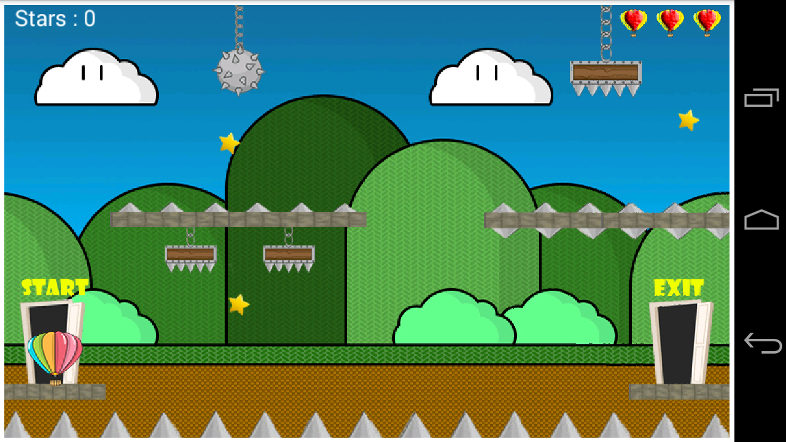

### Game Play
> Stage Selection

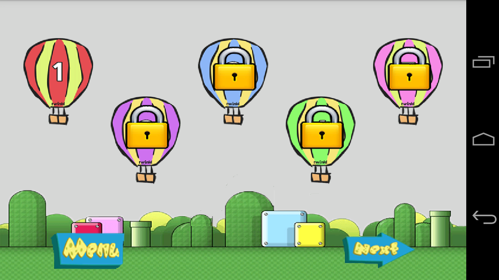

> Winner Screen

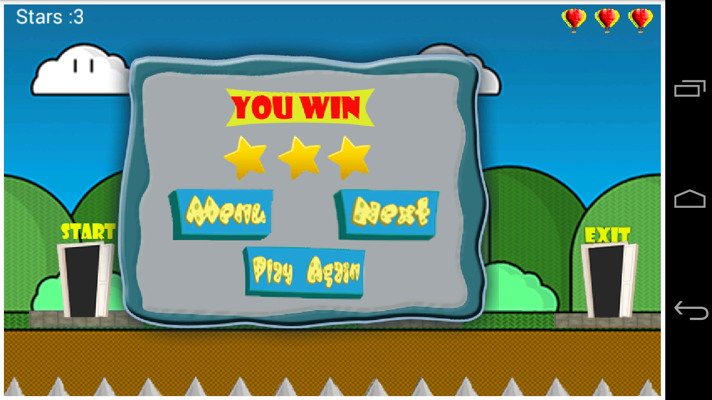

> Lose Screen

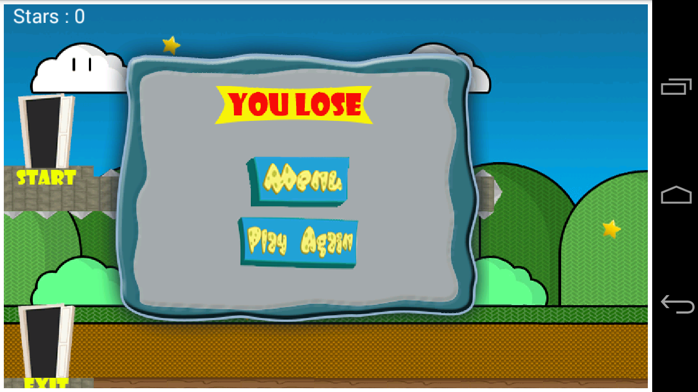

### Play Instructions
> Loading Screen

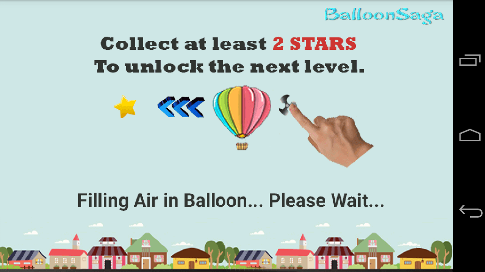

> How To Play Help

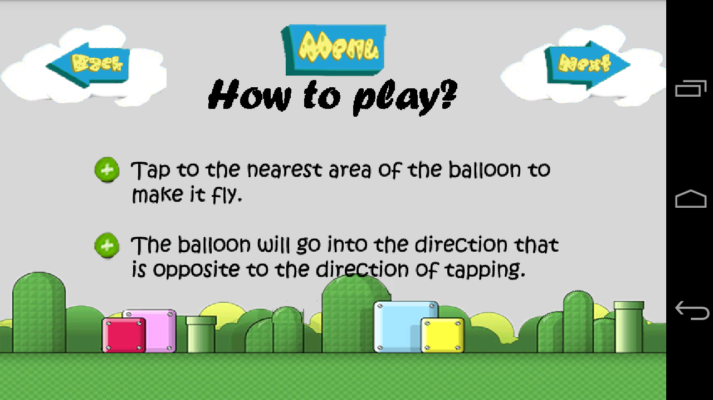

### Developers
> Developers

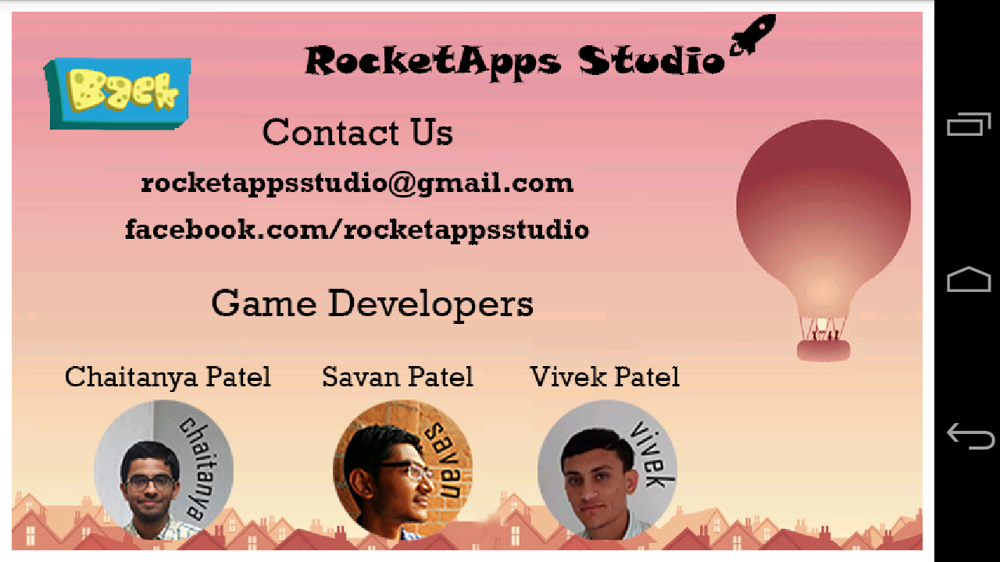

_Please review us on Play Store_
